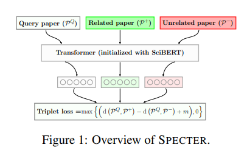

paper: https://arxiv.org/pdf/2004.07180
database (huggingface repo): https://huggingface.co/datasets/mteb/scidocs-reranking/discussions

Dataset has three column: query, positive, and negative.

Here I used positive as correct retrieved contexts, and generate embedding values of them to see the overlop phenomenon.